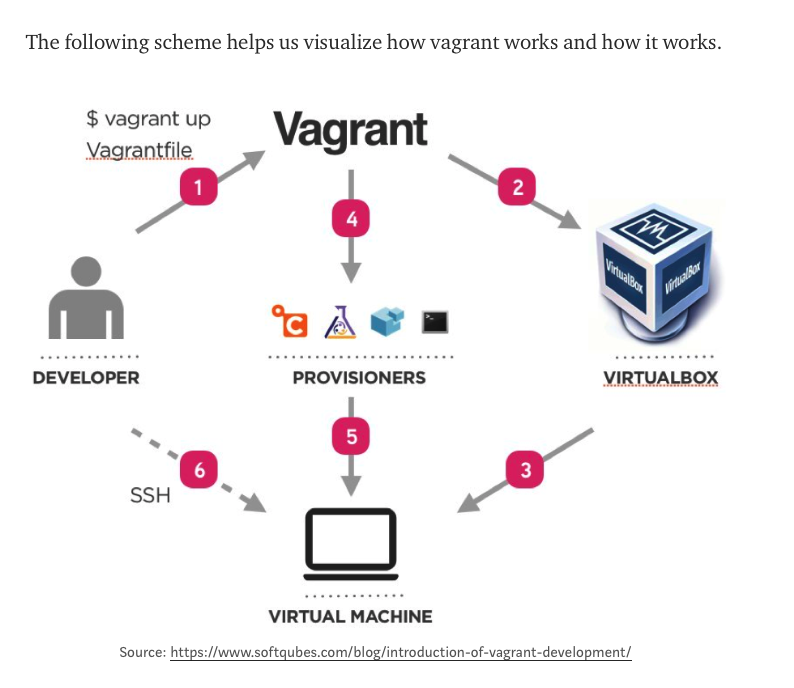

## According to Vagrant:

https://hackernoon.com/devops101-vagrant-6737c8c29904

Environments managed by Vagrant can run on local virtualized platforms such as VirtualBox or VMware, in the cloud via AWS or OpenStack, or in containers such as with Docker.

Vagrant provides the framework and configuration format to create and manage complete portable development environments. These dvelopment environments can live on your computer or in the cloud, and are portable between Windows, Mac OS X, and Linux.

Scripts that run after the machines are launched can be configured through several provisioners such as the shell, Terraform, Chef and Ansible.

Provisioners are meant to leverage provisioning (installing dependencies), automation, configuration maangemetn, and orchestration. This meets the DevOps way of thinking and working.

###### $ vagrant init hashicorp/precise64
###### $ vagrant box list
###### $ vagrant up
###### $ vagrant ssh
###### $ vagrant status
###### $ vagrant global-status
###### $ vagrant port

