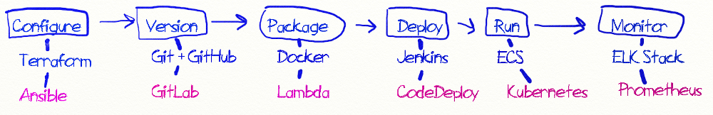

_DevOps is the union of people, processes and products to enable continuous delivery of value to end users."_
                                                                                     - _Donovan Brown_ -

## What is DevOps? (IBM Developer)

* DevOps is a software development approach for Development and Operations teams (Dev and Ops) which allows the teams to deliver innovative new applications faster and at a loswer cost with just the right features;

* It is a methodology that promotes colllaboration to build, test, and deploy products rapidly with an emphasis on quality;

* It is also the combination of Design, Development, Operations, and Testing through the implementation of automated pipelines that enable an environment of collaboration and continuous creation.

DevOps Principles (IBM Developer)

* Process improvement initiatives
* Continual experimentation
* Learners becoming teachers
* Using DevOps automation to improve efficiency
* Giving continuous feedback to the entire organization
* Incentivizing development, test, and deployment teams to collaborate on shared goals

# How To Become a DevOps Engineer 

https://medium.com/@devfire/how-to-become-a-devops-engineer-in-six-months-or-less-366097df7737

DevOps is a way to deliver software with shared pain and responsibility.

**devops**:DevOps is meant to combine the words developer and operations.It's an engineering practice and culture of automating and monitoring infrastructure to build and run software and services.
**netdevops**: NetDevOps expands upon DevOps principles, extending the engineering practices to the network.

#### What is the difference between Pipeline and Project in Jenkins?

The main difference between any job and a Pipeline Job is that the Pipeline Scripted job runs on the Jenkins master, using a lightweight executor expected to use very few resources in order to translate the pipeline to atomic commands that execute or send to the agents.

### Continuous Integration (CI) and Continuous Deploymnent (CD) techniques and principals designed to automate the workflow of a modern app developer.

### A CI/CD server allows us to piece together actions for our pipeline such as test code, package code, deploy code with simple "if. then, else" style logic.

## CI - Continuous Intergation

#### The primary goal of CI is to have an automated way to build and test applications. A higher software quality is expected since it leads to frequent changes and a better effort in collaboration in the team. 

  Development project often consists of many developers, all working on individual features and code. Eventually the individual work needs to be brought together and combined into a single code base. Individual developers should be testing their code as they work, but that code still needs re-verifying when it's part of the full codebase.
  Developing software requires planning for change, contibuously observing the results, and incrementally course-correcting based on the results. This is how CI operates.
  The practice of merging all developer working copies to a shared code line several times a day, and validating each integration with an automated build.

## CD - Continuous Delivery

#### Continuous delivery on the other hand is an extension of CI in a way that it picks up where CI left off. CD basically lets you automate all the releases to the infrastructure defined. It basically ensures an automated way to push the code changes.

  A software engineering approach in which teams produce software inshort cycles, ensuring thet software can be reliably released at any time. 
  In practice, continuous delivery focuses on an automated deployment pipeline.

## CD - Continuous Deployment
  Continuous Deploymnet is generally defined as a Continuous Delivery pipeline with no manual gates between initial code commit / check-in and production.

## Continuous Development ( CICD )

**Continuous development is the natural progression of iteration times shrinking into insignificance. Thtough heavy use of automation, flexible infrastructure and modular architecture, software development leaders have come to the point where each code change is its own deploymnet.

  * **Continuous Integration**: Merging of development work with code base constantly so that automated tetsing can catch problems early
  * **Continuous Delivery**: Software package delivery mechanism for releasing code to staging for review and inspection
  * **Continuous Deployment**: Relies on CI and CD to automatically release code into production as soon as it is ready. Constant flow of new features into production

Continuous Integration ----> Continuous Delivery ----> Continuous Deployment

**The microservice-based approach to architecting an application uses an API to expose discrete functions of the application; these functions are know as _microservices_**

### Container:

__Containers are isolated user spaces for running application code.__

  * Containers may run on a bare-metal system or in a virtualized OS.
  * Containers (at least the Docker model) are "immutable", meaning that they cannot be changed. In fact, they are versioned, similar to source control.
  * An application in a container typically runs as **root**. However, it does not have unrestricted access to the entire system on which it runs.

An application and it's dependencies are called an __image__.
A container is simply a running instance of an image.
By building software into container images, developers can easily package and ship an application without worrying about the system it will be running on.
You need software to build container images and to run them.
__Docker__ is one tool that does both.
Docker is an open source technology that allows you to create and run applications and containers.
But it doesn't offer a way to orchestrate those applications at scale like Kubernetes does.
In this course, we'll use Google's Cloud Build to create Docker formatted container images.
Containers are not an intrinsic primitive feature of Linux.
Instead, their power to isolate workloads is derived from the composition of several technologies.
One foundation is the __Linux process__.
Each Linux process has its own virtual memory address space separate from all others.
In Linux processes are rapidly created and destroyed.
Containers use Linux __namespaces__ to control what an application can see.
Process Id numbers, directory trees, IP addresses, and more.
By the way, Linux namespaces are not the same thing as Kubernetes namespaces, which you learn more about later on in this course.
Containers used Linux __cgroups__ to control what an application can use, its maximum consumption of CPU time, memory, IO bandwidth, and other resources.
Finally, containers use __union file systems__ to efficiently encapsulate applications and their dependencies into a set of clean minimal layers.

