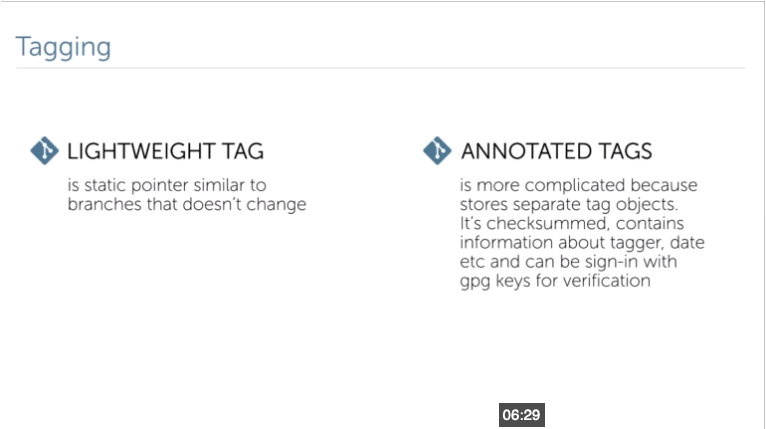

## Module 2. Example
__As for help the best way to find smth is find it on official documentation:__
<https://git-scm.com/docs>
__Or read a free book Pro git__
<https://git-scm.com/book/en/v2>
__Online or download it offline using in different formats.__
 
As for config I would recommend to use only __global__ and __local__ config unless You configure some CI server or chestrator server and want to make some config options available for all users. In that case __system__ option is the best way to do it.
 
__As an example of it we can use default push behaviour.__        
```
git config --system push.default none
```
__And each user should specify branch name during push all the time by default. Or editor config:__
```
git config --system core.editor “/path/to/editor --editor_param1=smth --editor_param2-smth, ...”
```
__But the best example is git configuration like:__
__Proxy setting:__
```git config --system core.gitproxy '"proxy command" for example.com'```
__Garbage collector settings:__
```git config --system gc.auto 0```
 
Etc…
 
__Git clone commands is also not that simple.__
__With standard set of params we an use it to clone only one branch and each pull__ __just downloads only objects from that branch ignoring all other objects and__ __branches, or last snapshot for some that branch, or 5 latest snapshots but still be__ __able to push into that branch.__
```
git clone git@url.com:user/repo --branch <name>
```
__Will clone repo and checkout to that branch (master by default) but__
```
git clone git@url.com:user/repo --branch <name> --single-branch
```
__Clone only that branch. Basically it clones only history of that branch.__
```
git clone git@url.com:user/repo --branch <name> --depth=1
```
__Clone last commit from branch name. By default --depth invokes --single-branch.__
 
__Bare repo, is a repo that contains only objects that never unpacked. Basically bare repo is a pure .git directory.__

```
git clone git@url.com:user/repo --bare
```
__Will clone objects but never unpack it into working directory. From the other hand it allows you to clone from this directory and pushed into it. E.g. If you clone .git directory of existing project you can’t push into it by default.__

## Modules 3

### Branching: manual


List, create or delete branches

```bash
git branch

git branch --remotes/-r

git branch --all/-a

git branch --list/-l *sql*

git branch --contains 07e5q56

git branch newbranch

git branch newbranch 07e5q56

git branch -d newbranch
```
 __origin/master__  
```$ git branch -r //remote branches```   
 __master__   
```$ git branch //local branches```  
__remotes/origin/master__   
```$ git branch --all //all branches```   
 
__Create branch from start point. Head by default__  
```$ git branch <name> <start_point>```

__Recreate branch with new start point if branch exists__
```$ git branch --force <name> <start_point>```
 
__If start_point is remote branch like__
```$ git branch next origin/next```
Git sets origin/next as a remote branch

__In case You create branch ...__  
```$ git branch mmm```  
and want to add upstream to it  
```$ git branch mmm --set-upstream-to=origin/pyramid```
 And  
```$ git branch mmm --unset-upstream```
To delete upstream

## Commintting


__Simple command to add all modified or deleted files (only tracked) from working directory and create a commit with Afs message.__  
```$ git commit -a -m ”Afs”```  

__Will recreate previous commit. You can use this command to change message or add new files.__  
```$ git commit --amend```  
```$ git commit -a --amend -m ”JIRA-123: Informative message about issue.”```  

__!!!WARNING don’t try to amend already pushed commit unless You know what you’re doing.__
If you have a commit  
>>git status -sb  
pdf_view...origin/pdf_view

>>git log -1  
commit 93c4f5916478fe9985b2cf5c33b6f09bdafb446f  
Author: Sasha <email@cocom.com>  
Date:   Fri Jan 20 21:15:15 2017 +0200  

Adding content service  
>>echo “.proj” >> .gitignore  
>>git add .gitignore  
>>git add commit --amend  

DON’T  >>git pull  

In this case, never. It will merge and create two commits old and new one. In such cases, in case this branch is yours push with force param. If it’s common branch don’t use amend, just create new commit.

## Tagging

 * lightweight
 * annotated tags

Tagging


Command


 ## Lead the way
Commiting


__Git tag__ 
>>git tag version-2.1  

__Creates lightweight tag__  
>>git tag -a version-3.0 -m "Version 3.0. Contains next features:"  

__Creates annotated tag with message and add some more information to it.__  
>>git tag
version-2.1
version-3.0

__Shows tags__
To see the difference between lightweight and annotated tags print information about tag  
>>git show version-2.1  
commit 93c4f5916478fe9985b2cf5c33b6f09bdafb446f  
Author: Sasha <email@cocom.com>  
Date:   Fri Jan 20 21:15:15 2017 +0200  

Adding content service  
...  
But  
>>git show version-3.0
tag version-3.0
Tagger: Sasha <email@cocom.com>
Date:   Fri Jan 20 21:20:23 2017 +0200

Version 3.0. Contains next features:

commit 4b19cc4781342ff616b0b6ccc2ad49f51ea822c8
Author: Sasha <email@cocom.com>
Date:   Fri Jan 20 21:15:15 2017 +0200

Adding content service to work with boilerplate templates
So annotated tag saves additional and very useful information.


