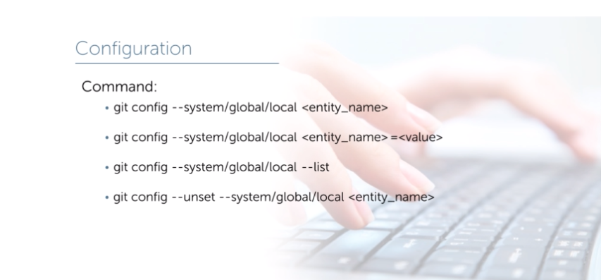
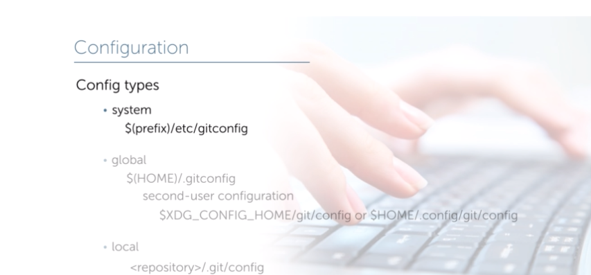
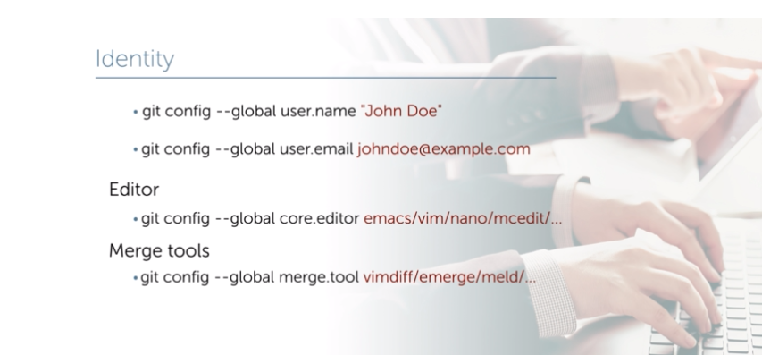
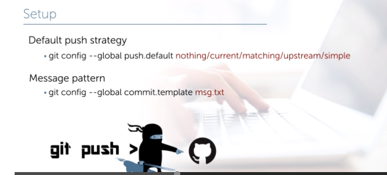
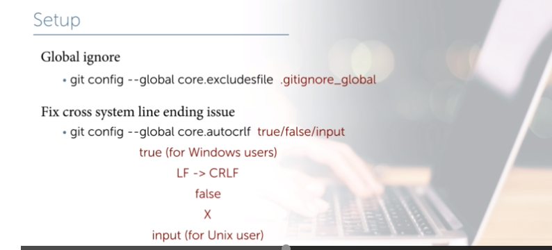
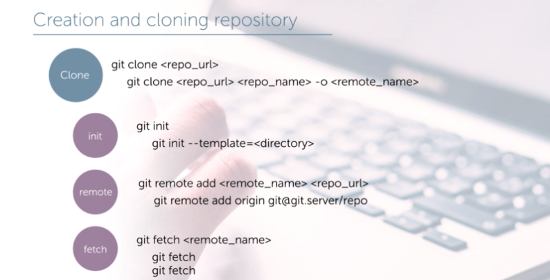
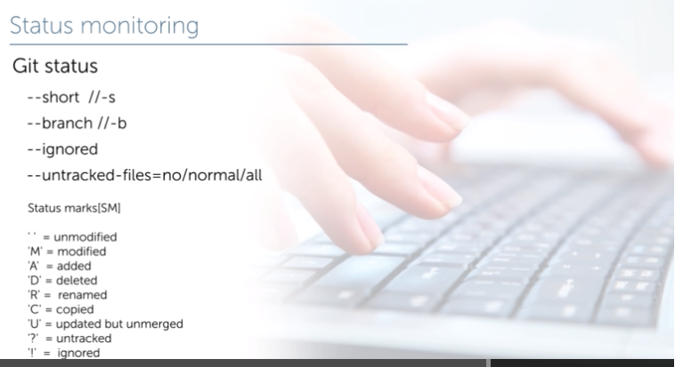
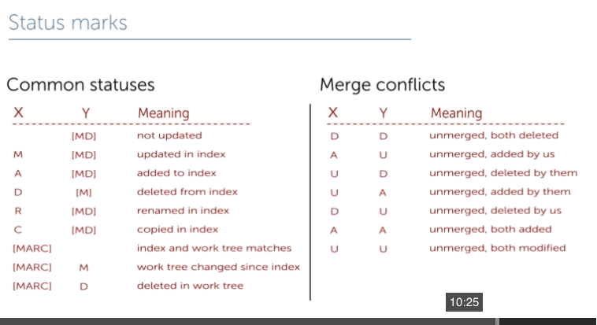
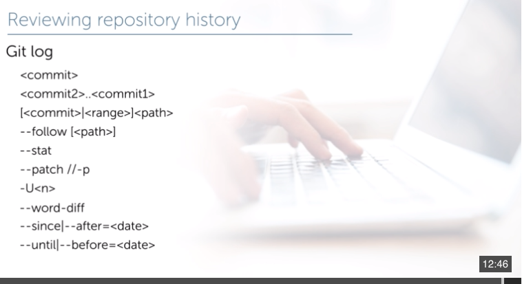

# GIT: from fundamental practices to advanced usage

## Introduction into SCM and basics

Version management
 * Application version management
 * Source code management

## Application version management
  * Versions with clear feature list
  * Easy to get appropriate version
     * Different sustem requirement
     * Differner feature list
     * Long term support
  * Change log for each version

Versions
  * Developers
  * Alpha
  * Beta
  * RC
  * Release

## Source code management
  * Monitor source code state
  * Manage revision
    * Review
    * Update
    * Revert
  * Code review
  * Each version is a list of particular revisions
  * Generate change log

## Type SCM 
### Centralized - CVS, Subversion(SVN) ,Perforce
#### PROS 
      * Anyone can always check from some point whar everyone else on the project is doing 
      * Faster and easier to prepare to marge changes with mainline
#### CONS
    * single point of failure   
### Local - small local database 
#### PROS
      * Very fast and easy to start system
      * Lot of tools that can create such db 
#### CONS
      * Risk to lose all your latest data
      * You need to copy manually all changes into other working PC    
### Distributed - GIT, Mercurial, Bazaar
#### PROS 
       * Each client has local backup of repository with all history
       * You can work locally  with local repository
       * Anyone can colloborate 

## Configuration
System  
Global  
Local  

## Identity

## Setup

## Push default behavior

## Creation and cloning repository

## Status monitoring

## Status marks

## Log

