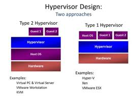

# Virtualization

## Type 1 Hypervisors ( bare metal ) 
 
#### Hypervisor runs directly on the physical hardware of the host machine and has direct access to the underlying hardware. It is considered to be best performing and most efficient for enterprise computing.
 
 * VMware ESX, ESXi
 * Microsoft HyperV
 * Citrix XenServer

## Type 2 Hypervisors ( hosted )

#### Hypervisors are typically installed on an existing Operating System. This makes it a hosted hypervisor, seeing as it relies on the host machine's OS to undertake certain operations like managing calls to the CPU, managing network resources, memory and storage.

 * VMware Workstation
 * Microsoft Virtual Server
 * Parallels
 * Oracle VirtualBox

## Shared operating system ( containers )

 * Parallels Virtuozzo Containers
 * Solaris Containers / Zone
 * Open VZ
 * LXC ( Linux )
 * Docker
 * FreeBSD Jail  